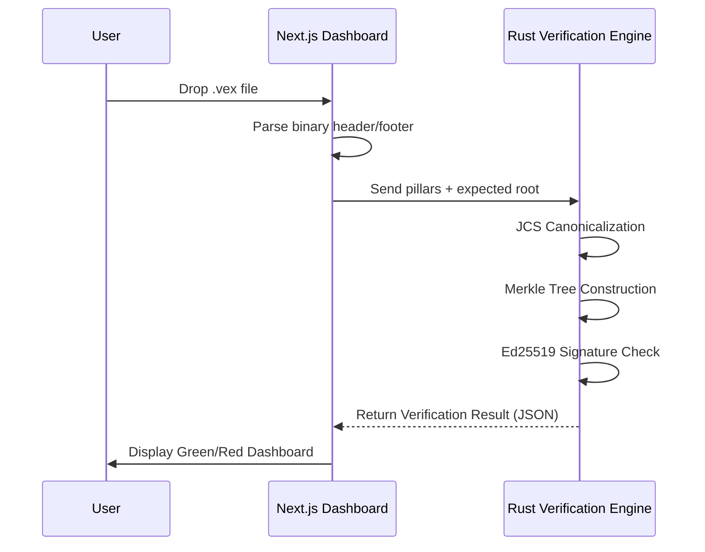

# VEX Explorer Architecture

VEX Explorer is a high-security, client-side-only verification dashboard for VEX Evidence Capsules.

## Architecture Overview

The system is split into two main components:

1.  **Frontend (Next.js 16)**: A modern, reactive dashboard that handles file I/O (Drag & Drop), visualization, and state management.
2.  **Verification Engine (Rust + WASM)**: A high-performance cryptographic core (`vex-verify`) compiled to WebAssembly. This ensures that sensitive cryptographic operations (hashing, signature verification) are executed in a memory-safe, predictable environment.

## Data Flow

## Security Model

### Zero Server-Side Visibility
The application is a pure client-side tool. Evidence capsules never leave the user's browser. There are no backend APIs that receive data.

### WASM Sandboxing
By moving the cryptographic logic to Rust/WASM, we gain:
- **Memory Safety**: Protection against buffer overflows common in C-based crypto libs.
- **Deterministic Hashing**: Consistent RFC 8785 implementation across different browser engines.
- **Performance**: Near-native speed for large Merkle tree calculations.

### Content Security Policy (CSP)
Strict CSP headers are enforced to prevent XSS and data exfiltration:
- `default-src 'self'`: Disallows external asset loading.
- `upgrade-insecure-requests`: Enforces HTTPS.
- `frame-ancestors 'none'`: Prevents clickjacking.

## Tech Stack
- **Framework**: Next.js 16 (App Router)
- **Styling**: Tailwind CSS v4
- **Language**: TypeScript + Rust
- **Serialization**: Serde (Rust), Serde-JCS (RFC 8785)
- **Deployment**: Railway / Vercel (Static)
