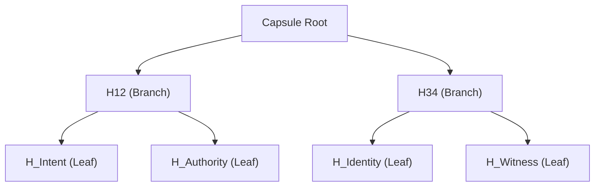

# VEX Evidence Capsule (VEP) Format Spec (v1.5)

VEP is a binary container format designed for cryptographically verifiable evidence pillars. It ensures integrity, authenticity, and selective disclosure.

## Binary Layout

A VEP capsule consists of three main segments:

1.  **Header (76 bytes)**: Versioning and identification.
2.  **Pillar Segment (Variable)**: The encoded data pillars (Intent, Authority, Identity, Witness).
3.  **Footer (76 bytes)**: A trailing copy of the header for backward-scan compatibility.

### Header / Footer Structure (76 bytes)

| Offset | Length | Type | Description |
| :--- | :--- | :--- | :--- |
| 0 | 3 | String | Magic "VEP" |
| 3 | 1 | UInt8 | Version (e.g., 3, 150) |
| 4 | 32 | Hex | AID (Authentic Identity) |
| 36 | 32 | Hex | Capsule Root (Merkle Root) |
| 68 | 8 | UInt64 | Nonce |

## Cryptographic Model (v3+)

Starting with version 3, VEP uses a **2x2 Merkle Tree** for selective disclosure.

### Leaf Computation
Each pillar is canonicalized using **RFC 8785 (JCS)** and hashed with SHA-256 using a `0x00` prefix.
`Leaf = SHA256(0x00 || JCS(Pillar))`

### Internal Node Computation
Internal nodes are hashed with SHA-256 using a `0x01` prefix.
`Internal = SHA256(0x01 || LeftHash || RightHash)`

### Tree Topology

## Security Guarantees
- **Integrity**: Any modification to a pillar breaks the Merkle Root.
- **Authenticity**: The Capsule Root is signed by the AID (Authority) using Ed25519.
- **Privacy**: Pillars can be redacted (sent as hashes only) while maintaining the validity of the root signature.
